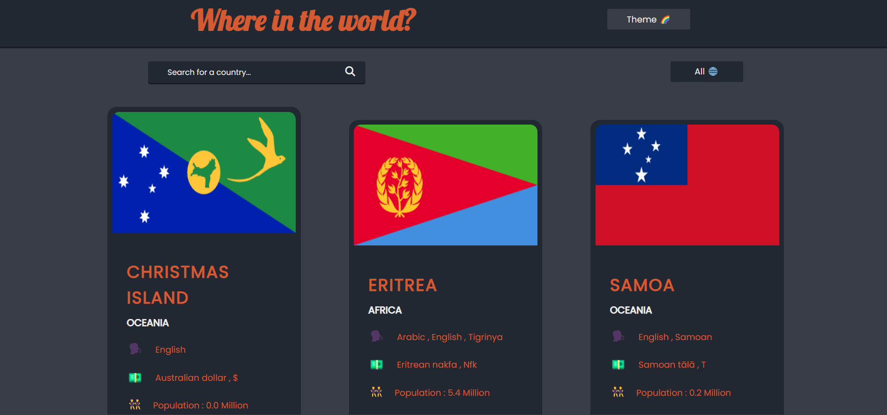
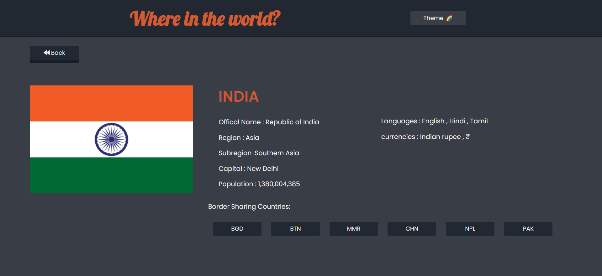

# Explore the world !

REST Countries API with color theme switcher

## Screenshots

## Challenge

The challenge was to integrate with the [REST Countries API ](https://www.frontendmentor.io/) to pull country data and display it like in the designs

## Version 1.0

- Fetch and display all countries on the homepage.
- Search country by name
- Filter countries by region
- Click on a country to see more detailed information on a separate page
- Click through to the border countries on the detail page
- Multiple options of theme

<!-- ## Demo

Check out the demo : -->
